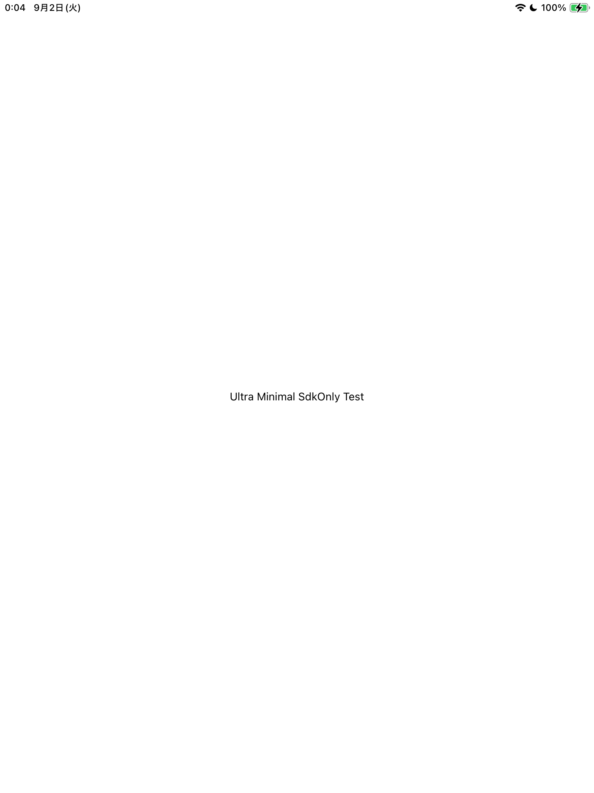

# UltraMinimalCrash - SdkOnly Linking Issue Reproduction

Minimal reproduction project for SdkOnly linking freeze issue in .NET 9 MAUI iOS

**Note**: This project uses a dummy bundle identifier `com.example.ultraminimalcrash`. You will need to update the bundle identifier in `UltraMinimalCrash.csproj` to match your own provisioning profile for device testing.

## Issue Summary

When building a .NET 9 MAUI iOS application with SdkOnly linking mode, the app freezes at the splash screen and the UI fails to render.

## Environment

### Development Environment

- **macOS**: Darwin 24.6.0 (macOS 15.6)
- **.NET SDK**: 9.0.304 (commit: f12f5f689e)
- **MSBuild**: 17.14.16+5d8159c5f
- **MAUI Workload**: 9.0.82/9.0.100
- **iOS Workload**: 18.5.9215/9.0.100
- **.NET Runtime**: 9.0.8
- **Xcode**: 16.4 (Build version 16F6)
- **iOS SDK**: 18.5

### Target Environment

- **iOS**: 12.2+ (tested on iOS 17.7.10)
- **Architecture**: ios-arm64
- **Device**: iPad (6th generation) Model A1893 (iOS 17.7.10)
- **Simulator**: iPhone 15 Pro (iOS 18.5) for comparison testing

## Project Structure

Minimal file structure:

```
UltraMinimalCrash/
├── App.cs                    # Application class with single Label
├── MauiProgram.cs           # MAUI app initialization
├── Platforms/
│   └── iOS/
│       ├── AppDelegate.cs   # iOS application delegate
│       ├── Main.cs          # Entry point
│       └── Info.plist       # iOS configuration
└── UltraMinimalCrash.csproj # Project configuration
```

## Screenshots

### iOS Simulator - Both linking modes work correctly


_iOS Simulator shows the app working correctly with both None and SdkOnly linking modes_

### Physical Device (iPad) - Clear difference in behavior

#### None Linking - Working correctly

_iPad shows the app working correctly with None linking - white background with centered text_

#### SdkOnly Linking - Frozen state

_iPad shows black/dark screen freeze with SdkOnly linking - UI fails to render_

## Build Instructions

### 1. Clean Project (Recommended)

```bash
rm -rf bin
```

### 2. Build

#### None Linking (Works Correctly)

```bash
# Set MtouchLink to None in .csproj first
dotnet build -c Debug -f net9.0-ios
```

#### SdkOnly Linking (Reproduces Freeze)

```bash
# Set MtouchLink to SdkOnly in .csproj first
dotnet build -c Debug -f net9.0-ios
```

## Device Installation & Execution

### 1. Find Device ID

```bash
xcrun devicectl list devices
```

### 2. Install

```bash
xcrun devicectl device install app --device [DEVICE_ID] bin/Debug/net9.0-ios/ios-arm64/UltraMinimalCrash.app
# Example: xcrun devicectl device install app --device CBFF4985-43D7-5B27-9283-13A7BD354BDE bin/Debug/net9.0-ios/ios-arm64/UltraMinimalCrash.app
```

### 3. Launch

```bash
xcrun devicectl device process launch --device [DEVICE_ID] --start-stopped com.example.ultraminimalcrash
```

### All-in-One (Build, Install, Launch)

```bash
rm -rf bin obj && \
dotnet build -c Debug -f net9.0-ios && \
xcrun devicectl device install app --device [DEVICE_ID] bin/Debug/net9.0-ios/ios-arm64/UltraMinimalCrash.app && \
xcrun devicectl device process launch --device [DEVICE_ID] --start-stopped com.example.ultraminimalcrash
```

## Switching Link Modes

Edit the following section in `UltraMinimalCrash.csproj`:

```xml
<!-- SdkOnly linking that causes splash freeze -->
<PropertyGroup Condition="'$(Configuration)'=='Debug' and '$(TargetFramework)'=='net9.0-ios'">
  <MtouchLink>SdkOnly</MtouchLink>  <!-- Options: None, SdkOnly, Full -->
  <RuntimeIdentifier>ios-arm64</RuntimeIdentifier>
</PropertyGroup>
```

## Test Results

### Physical Device (iPhone)

| Link Mode | Result     | Symptoms                                             |
| --------- | ---------- | ---------------------------------------------------- |
| None      | ✅ Works   | "Ultra Minimal SdkOnly Test" text displays in center |
| SdkOnly   | ❌ Freezes | Screen remains dark, UI doesn't render               |
| Full      | Not tested | -                                                    |

### iOS Simulator

| Link Mode | Result     | Symptoms                                             |
| --------- | ---------- | ---------------------------------------------------- |
| None      | ✅ Works   | "Ultra Minimal SdkOnly Test" text displays in center |
| SdkOnly   | ✅ Works   | "Ultra Minimal SdkOnly Test" text displays in center |
| Full      | Not tested | -                                                    |

**Important Finding**: The SdkOnly linking issue only occurs on physical iOS devices, not on simulators.

## Issue Details

- **Symptoms**: With SdkOnly linking enabled, app freezes at splash screen and UI doesn't render (physical devices only)
- **Affected**: .NET 9 MAUI iOS applications on physical devices
- **Not Affected**: iOS Simulator (works correctly with SdkOnly)
- **Behavior**: App appears to hang/freeze rather than crash (no crash logs generated)
- **Workaround**: Set linking mode to None (increases app size)

## Debugging Information

- **Process State**: App launches successfully but becomes unresponsive
- **Crash Reports**: No crash reports are generated (app hangs rather than crashes)
- **System Logs**: No obvious error messages in system logs during freeze
- **Memory**: App process remains in memory but becomes unresponsive

## Troubleshooting

### Build Errors

1. Manually delete bin/obj folders
2. Run `dotnet restore`
3. Rebuild
